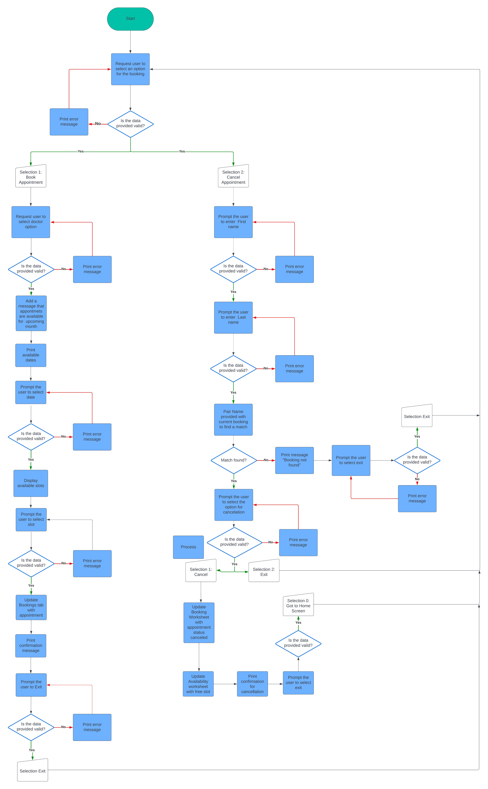

#Introduction

This doctor appointment management system allows the user to book a new appointment or cancel an existing by completing simple steps provided on the screen.

The booking system is built as a milestone Project#3 for Code Institute Full Stack Software Development course. The application is built using Python programming language and deployed on Heroku.

# User Stories

### New USer.

- I want to see clear instructions how to submit a new booking.
- I want to see available specialists
- I want to see available times
- I want to see confirmation one my booking is submitted

### Resturning user.

- As a returning user, I want to see the options to make a new booking 
- As a returning user, I want to be able to retrieve previously submitted booking and cancel

### System owner objectives

- As an app owner, I want to provide simple navigation instructions
- As an app owner, I want the app to be visualy pleasing and not cluttered

# Design

## Visual

- 

## Colour

-

## Font

## Flowcharts

# Tools and technologies used

## Languages

- Python language and modules
    - [gspread](https://pypi.org/project/gspread/) to interact with Google Sheets e.g. open, update. 
    - [pyfiglet](https://pypi.org/project/pyfiglet/) to add ASCII Text Art
    - [colored](https://pypi.org/project/colored/) to add colours for the terminal including text and banner
    - [os](https://docs.python.org/3/library/os.html) to interact with os
    - [clear](https://pypi.org/project/clear/) to clear the terminal
    - [time.sleep](https://docs.python.org/3/library/time.html?highlight=sleep#time.sleep) to pause the execution of the programm for a specified number of seconds
    - [pandas](https://pandas.pydata.org/) to covert the data to DataFrame

## Other tools and programs

- [Google Sheets](https://docs.google.com/spreadsheets/) to store "doctor_booking" sheet
- [Google Cloud Platform](https://console.cloud.google.com/) to create a project and generate API credentials
- [Lucidchart](https://www.lucidchart.com/) to create flowchart
- [Heroku](https://www.heroku.com/) to deploy the app
- [Python Template](https://github.com/Code-Institute-Org/python-essentials-template) is [Code Institute](https://codeinstitute.net/ie/) template used for this project
- [GitHub](https://github.com/) repository for code hosting

## Existing Features

### Welcome screen

- This is the first screen when the program is launched.
- To continue, user needs to select one of available options

### Book an appointment
- This screen appears when user selects option 1 in the welcome screen.
- User is prompted to select required specialist by entering number for selection
- The 

## Testing

- This app was developed using ASUS ROG laptop with Windows 10 OS. 
- Testing conducted while running in the terminal and after deployment to Heroku

### PEP8 Code Institute Python Linter testng

- TBC

![PEP8 Linter()]

### User Stories Testing

    | User Requirements | Result |
    | --- | ---|
    | I want to see clear instructions how to submit a new booking. |  |
    | I want to see available specialists |  |
    | I want to see available times |  |
    | I want to see confirmation one my booking is submitted |  |
    | As a returning user, I want to see the options to make a new booking |  |
    | As a returning user, I want to be able to retrieve previously submitted booking and cancel |  |
    | As an app owner, I want to provide simple navigation instructions |  |
    | As an app owner, I want the app to be visualy pleasing and not cluttered |  |

### Welcome screen testing

| Action | Expected Result | Actual Result | Image |
| --- | --- | --- | --- |
| --- | --- | --- | --- |
| --- | --- | --- | --- |
| --- | --- | --- | --- |

### Booking page testing

| Action | Expected Result | Actual Result | Image |
| --- | --- | --- | --- |
| --- | --- | --- | --- |
| --- | --- | --- | --- |
| --- | --- | --- | --- |

### Canceling page testing

| Action | Expected Result | Actual Result | Image |
| --- | --- | --- | --- |
| --- | --- | --- | --- |
| --- | --- | --- | --- |
| --- | --- | --- | --- |

## Google Lighhouse testing

## Problems solved

## Problems unsoved

## Deployment

### Create list of Requirements
- In terminal run command `pip3 freeze > requirement.txt` to create a list of requirements to be installed in Heroku

### Deploy with Heroku
- Sign up for [Heroku](https://dashboard.heroku.com/apps) account
- From the Heroku dashboard, click `Create new app`
- User a unique name for the project and chose a region. For this project `doctor-booking` has been selected as a name and Europe as a region. Click `Create App`
- Once the app is created, select `Settings` tab and navigate to `Config Vars`
- Click on `Reveal Config Vars`. 
    - In a field for KEY, type `CREDS`
    - Navigate to project CodeAnywhere workspace and copy contents of `creds.json`
    - Paste copied value into VALUE field in Config Vars in Heroku and click `Add`
- Under the same `Settings` tab, navigate to `Buildpacks`  
    - Click `Add Buildpack`, select `Python` and select `Save changes`
    - Click `Add Buildpack`, select `nodejs` and select `Save changes`
- Navigate to `Deploy` section
    - Navigate to `Deployment method` and select `GitHub` and click `Connect to GitHub`
    - Search for a repository name. For this project the name is `doctor-booking`. Click `Search` and `Connect`
- Navigate to Automatic deploys and select `Enable Automatic Deploys` 
    - The deployment will begin
    - The message will appear to confirm successful deployment
    - Click `View` to open deployed application

# Credits
 - [Code Institute](https://codeinstitute.net/ie/) for valuable resources and inspiration

